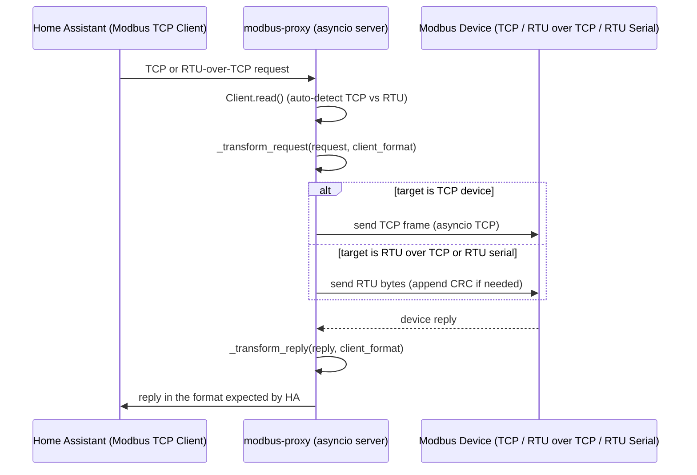
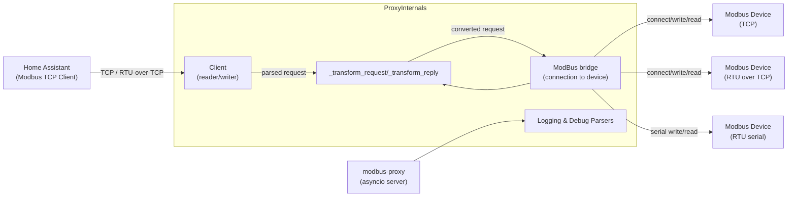

# modbus-proxy — Architecture and Flow

This document explains how `modbus-proxy` (the proxy between Home Assistant and Modbus devices) works, with diagrams and links to the relevant code in the repository.

**Overview**
- The proxy exposes a Modbus TCP server that Home Assistant (or other Modbus TCP clients) can talk to.
- The proxy translates between Modbus TCP (MBAP frames) and RTU (serial) or RTU-over-TCP when needed.

**Key runtime components**
- Client handler: reads client requests and auto-detects format (`Client._read`).
- Transformer: converts requests and replies between formats (`ModBus._transform_request`, `ModBus._transform_reply`).
- Bridge: maintains connection to the real device (TCP or serial) and performs write/read (`ModBus.open`, `ModBus._write`, `ModBus._read`, `_read_rtu`).

Files to inspect:
- `modbus-proxy/src/modbus_proxy.py` — main implementation (see function references below).

Important code locations (workspace relative links):
- Client auto-detect and parsing: [modbus-proxy/src/modbus_proxy.py](modbus-proxy/src/modbus_proxy.py#L334-L387)
- Request transformer: [modbus-proxy/src/modbus_proxy.py](modbus-proxy/src/modbus_proxy.py#L562-L668)
- Reply transformer: [modbus-proxy/src/modbus_proxy.py](modbus-proxy/src/modbus_proxy.py#L672-L772)
- Connect / serial open: [modbus-proxy/src/modbus_proxy.py](modbus-proxy/src/modbus_proxy.py#L432-L483)
- RTU read helper: [modbus-proxy/src/modbus_proxy.py](modbus-proxy/src/modbus_proxy.py#L212-L266)
- Main request loop (per client): [modbus-proxy/src/modbus_proxy.py](modbus-proxy/src/modbus_proxy.py#L785-L813)


**Mermaid sequence diagram**




**Mermaid architecture diagram**

Inline diagram (Mermaid):



Rendered image (if available):


(The sequence diagram is available in Mermaid format in the repository — see `docs/sequence.mmd`.)


**Notes / Tips**
- Unit ID remapping is configured through `unit_id_remapping` in the device config; transformations apply both to requests and replies.
- For serial devices the code prefers `serial_asyncio` and falls back to `pyserial` sync mode if unavailable.
- Logging helpers `_log_modbus_message` and `_log_rtu_message` provide detailed parsing when debug logging is enabled.

If you want, I can:
- Add `.mmd` files with the diagrams into `docs/` (so they render in some viewers).
- Generate PNG/SVG renderings (requires mermaid CLI availability).
- Expand the README with sample config and run instructions.

How to preview in VS Code
- Install the recommended extensions (vscode will prompt if you open the workspace):
    - Mermaid preview: `bierner.markdown-mermaid`
    - Draw.io (optional): `hediet.vscode-drawio`

- Open `docs/architecture.mmd` or `docs/sequence.mmd` and use the Mermaid preview provided by the extension.

Repository diagram files:
- docs/architecture.mmd — Mermaid architecture diagram
- docs/sequence.mmd — Mermaid sequence diagram

Quick rendering via CLI (optional)
You can render diagrams locally if you have the appropriate CLIs installed.

Mermaid CLI example:
```bash
npx @mermaid-js/mermaid-cli -i docs/architecture.mmd -o docs/architecture.svg
```

<!-- PlantUML removed: use mermaid CLI to render Mermaid diagrams -->
